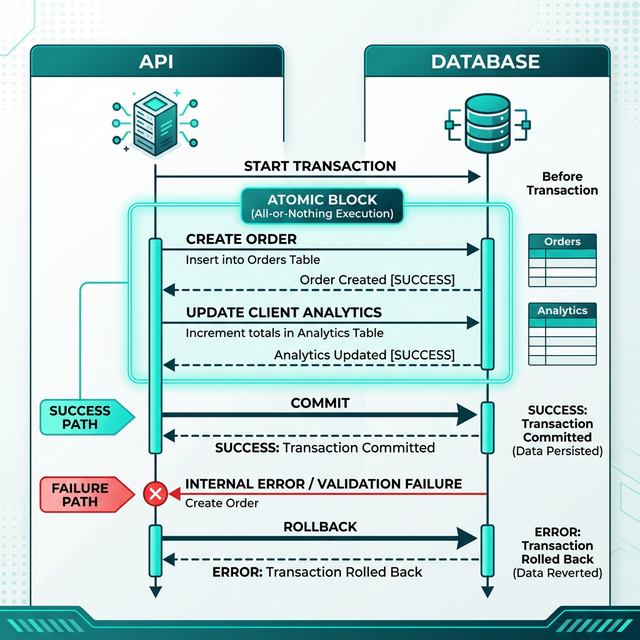

# Tasty Station POS - Backend Architecture 🌩️

The backend of the Tasty Station Point of Sale system is a robust, secure, and scalable REST API built with **Node.js** and **Express 5**. It is designed to handle the high concurrency and reliability demands of a busy restaurant environment.

---

## 🏗️ Core Technologies

*   **Runtime Framework:** Node.js + Express.js v5
*   **Database:** MongoDB Atlas + Mongoose ODM
*   **Real-Time:** Socket.io
*   **CachingLayer:** Redis (Upstash)
*   **Authentication:** JSON Web Tokens (JWT) via HttpOnly Cookies
*   **Media Storage:** Cloudinary

---

## ⚡ Key Features & Engineering Decisions

### 1. Data Atomicity (MongoDB Transactions)
To ensure financial data integrity during complex checkout flows, all multi-document operations are wrapped in **MongoDB Session Transactions**. 


*   **Benefit:** If the server crashes after creating an order but before updating a client's loyalty history, the entire flow rolls back, preventing corrupt, disconnected data.

### 2. Real-Time Event Driven Architecture
Traditional HTTP polling overloads servers in high-volume POS systems. We implemented **TCP WebSockets via Socket.io**.
*   **How it works:** When a cashier creates an order, the Express controller immediately emits a `newOrder` event. The kitchen dashboard natively listens to this open socket connection and updates its UI instantly without ever requesting the server for new data.

### 3. Layered Security
*   **Stateless Authentication:** JWTs are delivered exclusively via `HttpOnly`, `Secure` cookies. This prevents malicious client-side JavaScript from accessing tokens, mitigating XSS attacks.
*   **Rate Limiting:** Public endpoints (like `/api/users/login`) are protected by `express-rate-limit` to prevent brute-force attacks and DDOS floods.
*   **Input Validation:** The `express-validator` middleware is positioned ahead of the business logic to reject malformed requests before they consume database resources.

### 4. High-Performance Read Strategies
*   **Redis Caching:** Frequently accessed menu categories and dashboard statistics are cached in Redis. We implemented a custom `clearCache` utility using pattern-matching `SCAN` logic to invalidate specific caches instantly when menus are updated.
*   **Compound Indexing:** The most heavily queried database path (Recent Pending Orders) uses a B-Tree Compound Index `({ status: 1, createdAt: -1 })`, transitioning database lookups from `O(N)` scans to sub-millisecond `O(log N)` seeks.

### 5. Centralized Error Handling
Replaced fragmented `try-catch` blocks with a unified error pipeline.
*   **Custom `ApiError` Class:** Enforces standardized HTTP status codes and payloads.
*   **Global Middleware:** Intercepts all failed promises, strips stack traces in production, and guarantees a uniform JSON error schema for the frontend to consume.

---

## 📁 Directory Structure Overview

```text
backend/
├── config/              # Environment, DB, and Cloudinary setups
├── controllers/         # Core business logic (Orders, Menu, Users, Dashboard)
├── middlewares/         # Auth verification, rate limiting, error catching
├── models/              # Mongoose DB Schemas
├── routes/              # Express API route definitions
├── utils/               # Helper classes (ApiError, ApiResponse) and Token generators
└── index.js             # Application entry point & Server configuration
```

---

## 🚀 Getting Started

1. **Install Dependencies:**
   ```bash
   npm install
   ```

2. **Environment Variables:**
   Create a `.env` file referencing the required keys:
   ```env
   PORT=5000
   MONGO_URI=your_mongodb_cluster_string
   JWT_SECRET=your_secret_key
   REDIS_URL=your_redis_connection_string
   CLOUDINARY_CLOUD_NAME=name
   CLOUDINARY_API_KEY=key
   CLOUDINARY_API_SECRET=secret
   NODE_ENV=development
   ```

3. **Start the Development Server:**
   ```bash
   npm run dev
   ```
