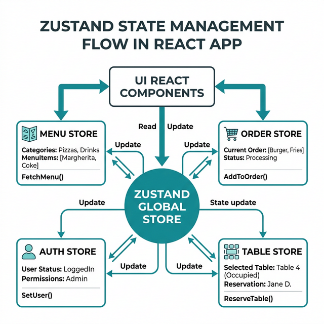

# Tasty Station POS - Frontend Application 🚀

The frontend of the Tasty Station Point of Sale system is a lightning-fast Single Page Application (SPA) built with **React 18** and **Vite**. It is engineered for a high-intensity restaurant environment, focusing on speed, reliability, and an intuitive user experience.

---

## 🎨 Technologies & UI/UX

*   **Core:** React 18 + Vite
*   **Routing:** React Router DOM (v7)
*   **Styling:** Tailwind CSS v4
*   **Components:** Shadcn UI (Radix Primitives)
*   **Animations:** Framer Motion
*   **Icons:** Lucide React
*   **Printing:** React-to-Print (For receipt generation)

---

## 🧠 State Management (Zustand)

Rather than using Redux (heavy boilerplate) or Context API (unnecessary re-renders), the POS uses **Zustand** for lean, atomic state management.



### Key Optimizations:
*   **State Persistence:** The `useAuthStore` and `useOrderStore` are wrapped in Zustand's built-in `persist` middleware. This syncs the active shopping cart and login session to the browser's storage. If a cashier accidentally refreshes the page during a $200 checkout, the cart state is instantly recovered, preventing revenue loss.
*   **Granular Subscriptions:** Components only subscribe to the specific state slices they need, preventing the entire dashboard from re-rendering when a single order is updated.

---

## 🚀 Performance Engineering

### 1. Code-Splitting (`React.lazy` & `Suspense`)
The POS application is thick, housing both the lightweight checkout terminal and the massive Admin reporting dashboard. Bringing all of this JavaScript to the browser on the initial load would cripple the Time-to-Interactive. 
*   **Solution:** We implemented route-level code-splitting. Cashiers only download the JS bundles required for the order terminal. Administrative modules (Staff Management, Sales Charts) are lazy-loaded on demand when navigated to.

### 2. Render Pruning (`React.memo`)
*   **The Problem:** The order menu displays 50+ items at once. Without optimization, adding a single burger to the cart would cause React to run its Virtual DOM diffing algorithm across the entire grid of 50 items.
*   **The Solution:** Heavy UI lists (`MenuItemCard`, `OrderTableRow`) are wrapped in `React.memo()`. React now skips rendering components whose props (like item price or name) haven't changed, saving critical CPU cycles on lower-end iPad terminals.

---

## 📡 Real-Time & Fault Tolerance

### 1. Progressive Web App (PWA) Offline Mode
POS systems are mission-critical. An internet outage cannot stop the restaurant from functioning.
*   We implemented a **PWA Service Worker** using `vite-plugin-pwa`.
*   **How it works:** The Service Worker aggressively caches the "App Shell" (HTML, JS, CSS, and static assets). If the tablet loses internet connectivity, the browser intercepts the network request and serves the entire POS interface instantly from the local cache instead of crashing to a generic "No Internet" screen.

### 2. Event-Driven Sockets (`Socket.io-client`)
*   The application maintains a persistent, bidirectional TCP connection with the backend. 
*   When a waitstaff creates an order, the kitchen dashboard instantly receives a `newOrder` event and mutates the local Zustand state to display the ticket—zero manual polling required.

### 3. Rapid Keyboard Navigation
*   Cashiers value speed over clicks. The `OrderPage.jsx` implements global `keydown` event listeners, allowing checkout confirmations via physical keyboard endpoints (e.g., hitting `Enter` to finalize the sale) without lifting a mouse.

---

## 🧪 Testing Coverage (Vitest)

Critical financial logic lives in the frontend (Cart totals, tax calculations). To prevent regressions, we implemented a robust unit testing suite using **Vitest**.

*   `useOrderStore.test.js`: Mocks external dependencies (Axios, Socket) to rigorously assert that items add correctly, quantities increment, items remove cleanly, and the cart resets accurately. Ensure confident deployments in CI/CD environments.

---

## 💻 Getting Started

1. **Install Dependencies:**
   ```bash
   npm install
   ```

2. **Environment Variables:**
   Ensure you have a `.env` configured:
   ```env
   VITE_API_BASE_URL=http://localhost:5000/api
   ```

3. **Start the Development Server:**
   ```bash
   npm run dev
   ```

4. **Run Unit Tests:**
   ```bash
   npm test
   ```
