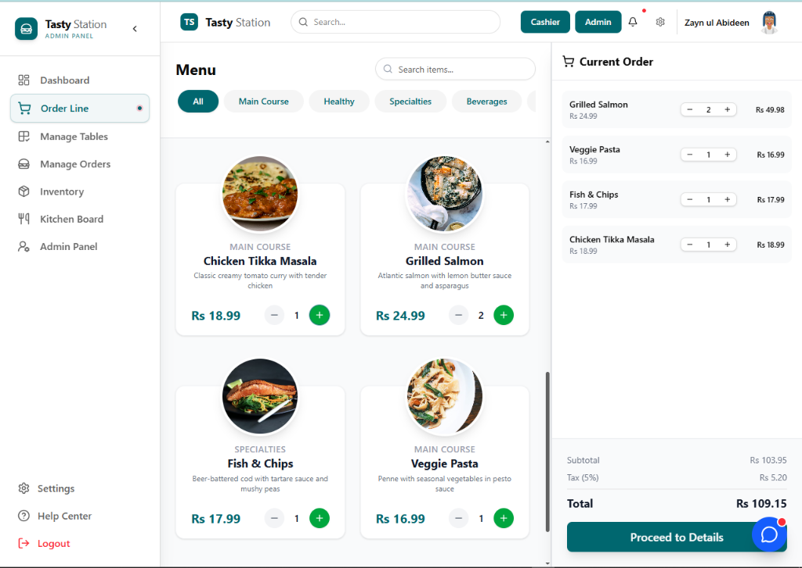
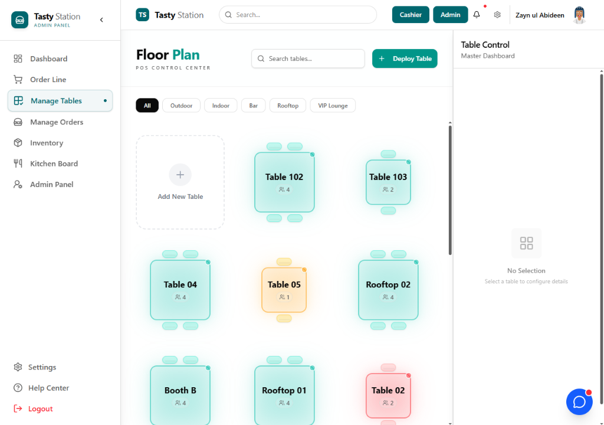
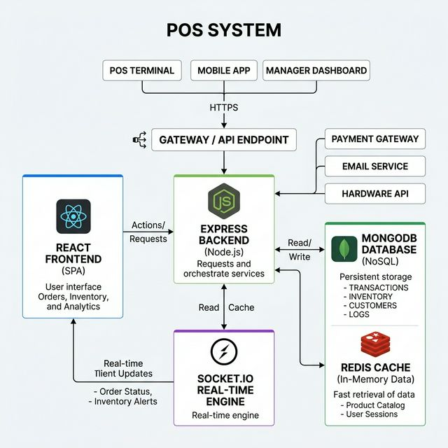
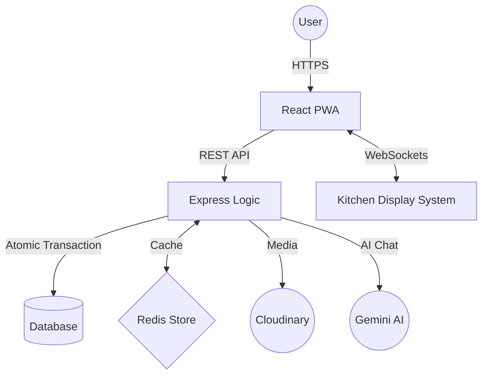

# 🍽️ Tasty Station POS — Enterprise Restaurant POS System

[](https://vitejs.dev/)
[](https://reactjs.org/)
[](https://nodejs.org/)
[](https://expressjs.com/)
[](https://socket.io/)
[](https://redis.io/)
[](https://www.mongodb.com/)
[](https://vitest.dev/)
[](https://opensource.org/licenses/MIT)

**Tasty Station POS** is a high-performance, enterprise-grade Point of Sale (POS) and Kitchen Display System (KDS) designed for modern high-volume restaurants. Built for speed, resiliency, and accuracy, it leverages the MERN stack with advanced engineering patterns to handle the "Lunch Rush" without breaking a sweat.

---

## 🖼️ Preview

### Dashboard


> _Premium SaaS Aesthetic with Dark Mode support and Real-time syncing._

### Modern Menu Interface (Light & Dark Mode)

| Light Mode | Dark Mode |
| :--- | :--- |
|  |  |

### 🗺️ Dynamic Floor Plan & Table Management

| Light Mode | Dark Mode |
| :--- | :--- |
|  |  |

### System Architecture


---

## ⚡ Core Engineering Pillars

### 1. 🛡️ Data Integrity & Atomic Financials

- **MongoDB Transactions:** Every order involves multi-document writes (Orders, Client Stats, Inventory Deduplication). We use **ACID Transactions** to ensure that either all updates succeed or none do—preventing financial drift.
- **Redis Caching Layer:** Dashboard analytics and frequent menu reads are served via **Redis** memory stores, dropping retrieval times from `~150ms` (DB) to `<12ms`.
- **Stateless Security:** Authentication is handled via **HttpOnly JWT Cookies**, providing a robust defense against XSS and CSRF.

### 2. 📡 Real-Time Kitchen Display System (KDS)

- **Socket.io Integration:** Orders are not polled via HTTP. They are pushed instantly to kitchen monitors via event-driven WebSockets.
- **Station Synchronization:** When a chef marks an order as "Ready," the Cashier UI reflects the status change in milliseconds without a page refresh.
- **Sound Notifications:** Audio chime on new order arrival (toggleable), browser desktop notifications support.
- **NEW badge & Urgency:** New orders get a teal "NEW ✨" badge for 5 seconds; orders pending >15 minutes get amber urgency styling.
- **Station Filter:** Filter orders by preparation station (Grill, Salad, Bar, etc.) dynamically generated from menu categories.

### 3. 📱 Progressive Web App (PWA) Capability

- **Offline Resilience:** Designed to handle "Internet Drops." Critical app shells are cached via Service Workers, ensuring the POS remains navigable and operational on local hardware even during downtime.

### 4. 🧪 Robust Testing & Code Quality

- **Unit & Integration:** Powered by **Vitest** and **React Testing Library**.
- **API Validation:** Synthetic endpoint testing via **Supertest** with an isolated `mongodb-memory-server` fixture for 100% data safety.
- **Strict Standards:** Enforced with **ESLint** (Flat Config) + **Husky** + **commitlint** ensuring clean, predictable, error-free code with Conventional Commits.

---

## 👤 Persona-Based Experience

### 👑 Admin Portal
- **Advanced Analytics:** Visualize sales trends, peak hours, and server performance.
- **Menu Management:** Dynamic category creation, cloudinary-integrated image uploads, and inventory tracking.
- **User RBAC:** Manage permissions for 6 roles (admin, manager, cashier, waiter, kitchen, client).
- **Loyalty Program:** Configure rewards, tiers (Bronze/Silver/Gold/Platinum), and point multipliers.
- **Backup & Restore:** ZIP-based full database backup and restore with optional `dropExisting`.

### 📟 Cashier Terminal
- **Rapid Checkout:** Optimized for touch-screens and keyboard shortcuts (Enter = Place Order).
- **Table Management:** Real-time visibility of table occupancy and order status.
- **Client Profiles:** Quick access to regular customers and loyalty stats.
- **Split Payments:** Multiple payment methods per order (Cash + Card + Online) with live balance tracking.

### 👨‍🍳 Kitchen Display (KDS)
- **Live Ticket Feed:** Orders appear instantly with preparation time trackers.
- **Status Toggles:** One-click updates for "Preparing," "Ready," and "Delivered."
- **Station Filter:** Filter orders by preparation station.
- **Sound Alerts:** Audio chime on new arrivals + browser desktop notifications.

### 🤵 Waiter Terminal (NEW)
- **My Tables:** Quick overview of tables assigned to the logged-in waiter.
- **Quick Actions:** Seat & Order, Add Item, Check-in buttons per table.
- **My Recent Orders:** Last 5 orders placed by the waiter.
- **Live Stats:** Active, reserved, available, occupied counters.

### 🎁 Loyalty Program (NEW)
- **Tier System:** Bronze → Silver → Gold → Platinum based on total spend.
- **Point Multipliers:** Higher tiers earn points faster (Bronze 1x → Platinum 2x).
- **Rewards Catalog:** Configurable rewards (fixed discount, percentage, free item).
- **Auto-Award:** Points automatically awarded when order is marked Completed.
- **Manual Adjustment:** Admin can manually add/deduct points with reason.

### 🗺️ Drag-and-Drop Floor Plan Editor (NEW)
- **Visual Layout:** Drag tables to position them on a grid canvas.
- **Shape Cycling:** Switch between circle, square, rectangle per table.
- **Save & Reset:** Batch save positions or reset to auto-arrange.
- **Edit/Lock Toggle:** Prevent accidental drags with lock mode.

### 📱 QR Code Ordering (NEW)
- **Customer-Facing:** Guests scan QR code on their table to browse menu and place orders.
- **No App Required:** Works in any mobile browser — no download needed.
- **Real-Time:** Orders appear instantly in KDS and POS via Socket.io.
- **QR Code Generator:** Admin generates and prints branded QR codes for each table.
- **Mobile-Optimized:** Touch-friendly interface with search, category filters, cart.

### 🏢 Multi-Outlet Sync (NEW)
- **Chain Management:** Manage multiple restaurant locations from one dashboard.
- **Outlet Model:** Each outlet has its own tables, inventory, staff, but shared menu and clients.
- **Opening Hours:** Per-outlet opening hours with closed-day support.
- **Outlet-Specific:** Currency override, tax number, manager assignment.
- **Primary Outlet:** Designate HQ outlet for central administration.

### 🇸🇮 FURS Integration (NEW — Slovenian Fiscal System)
- **Davčno Potrjevanje:** Automatic fiscal invoice confirmation for Slovenian compliance.
- **ZOI Generation:** Zaščitna Oznaka Izdajatelja (MD5 signature with certificate).
- **EOR Tracking:** Enkratna Identifikacijska Oznaka Računa from FURS.
- **QR Code on Receipt:** FURS-compliant QR code for invoice verification.
- **Invoice Numbering:** Sequential per-outlet invoice numbers (OUTLET_CODE-YEAR-SEQUENCE).
- **Retry Failed:** Admin can retry failed FURS confirmations.
- **10-Year Archive:** FiscalInvoice model preserves all data for legal retention.
- **Test/Production:** Configurable FURS endpoints (test vs production).

### 📊 Comprehensive Reports Dashboard (NEW)
- **Single-Call Dashboard:** 8 aggregations in one API call (sales trend, P&L, top items, cashiers, status breakdown, payment methods, hourly distribution, summary KPIs).
- **Custom Date Range:** Filter by daily/weekly/monthly/yearly or custom start/end dates.
- **Category Performance:** Revenue breakdown by menu category.
- **Visual Charts:** Bar charts for sales trend, hourly distribution, category performance.

### 🛡️ Audit Log (NEW)
- **30+ Action Types:** Tracks logins, orders, payments, backups, loyalty, currency changes.
- **Filtering:** By action, entity, user, status, date range, text search.
- **Statistics:** Top actions, status breakdown, active users.
- **Auto-Expire:** Logs auto-delete after 365 days (configurable).
- **Non-Blocking:** Audit logging never breaks main application flow.

---

## 🌍 Internationalization (i18n)

Full multi-language support with **Slovenian (default)** and **English**:
- Language switcher in navbar (Globe icon).
- 95+ translation keys covering all UI text.
- Language preference saved to localStorage.
- Easy to extend with additional languages — just add a new JSON file in `/frontend/src/i18n/locales/`.

---

## 📂 Project Topography

```text
Tasty-Station-POS/
├── backend/                    # Express API & Business Logic
│   ├── config/                 # Database, Cloudinary, Socket.io configs
│   ├── controllers/            # 16 controllers (order, loyalty, backup, currency, audit, forecast, outlet, ...)
│   ├── models/                 # 15 Mongoose models (User, Order, Table, Reward, Outlet, FiscalInvoice, ...)
│   ├── routers/                # 20 API routers
│   ├── middlewares/            # Auth, cache, error, validators
│   ├── redis/                  # Redis client with graceful fallback
│   ├── utils/                  # ApiError, logger, genrateToken
│   ├── __tests__/              # Vitest & Supertest suite
│   ├── dev.js                  # Dev startup with auto-seed (NEW)
│   ├── seed.js                 # Standalone seed script
│   └── data.js                 # Demo data (12 users, 25 items, 15 tables, 6 rewards)
├── frontend/                   # Vite + React Client
│   ├── src/
│   │   ├── components/         # 25 Shadcn UI components + chat widget
│   │   ├── pages/
│   │   │   ├── Auth/           # Login, Signup (i18n)
│   │   │   ├── dashboard/      # Cashier/Waiter/Kitchen pages
│   │   │   ├── Admin/          # 17 admin pages (lazy-loaded)
│   │   │   └── QR/             # Customer-facing QR ordering page
│   │   ├── store/              # 16 Zustand stores (auth, order, kitchen, loyalty, audit, forecast, ...)
│   │   ├── i18n/               # Slovenian + English translations
│   │   └── axios/              # Configured interceptors
│   └── vite.config.js
├── docs/                       # Screenshots, diagrams, reports
│   ├── screenshots/            # Live application screenshots
│   └── architecture.png
├── start.sh / stop.sh          # Service management scripts (NEW)
├── docker-compose.yml          # MongoDB + Redis for production (NEW)
├── LICENSE                     # MIT license
├── CONTRIBUTING.md             # Contribution guidelines
├── CODE_OF_CONDUCT.md          # Community standards
└── readme.md                   # You are here
```

---

## 🛠️ Tech Stack

| Layer              | Technologies                                                              |
| :----------------- | :------------------------------------------------------------------------ |
| **Frontend**       | React 19, Vite, Zustand, Framer Motion, Tailwind CSS, Shadcn UI, i18next |
| **Backend**        | Node.js, Express 5, MongoDB, Mongoose, Socket.io, Redis                   |
| **Auth**           | JWT (HttpOnly cookies), bcryptjs, express-rate-limit                      |
| **DevOps/Testing** | Vitest, Supertest, ESLint, Husky, Conventional Commits                    |
| **Cloud**          | Cloudinary (Image Management), Gemini AI (Chat)                           |

---

## 🗺️ System Architecture

<br/>


<br/>

<details>
<summary>📐 View technical Mermaid flowchart</summary>


</details>

<br/>

---

## 🚀 Quick Start

### Prerequisites

- Node.js 18+ and npm
- MongoDB 6+ (or use Docker Compose)
- Redis 7+ (optional — app works without cache)

### 1. Clone the repository

```bash
git clone https://github.com/markec12345678/Tasty-Station-POS.git
cd Tasty-Station-POS
```

### 2. Backend setup

```bash
cd backend
npm install
cp .env.example .env  # configure environment
npm run dev:seed      # starts backend with auto-seed if DB is empty
```

The backend will:
- Try to connect to MongoDB at `MONGO_URI` (default: `mongodb://localhost:27017/tastystation`)
- If MongoDB is unreachable, **automatically fall back to in-memory MongoDB** (dev only — data is lost on restart)
- Skip Redis gracefully if not available (cache disabled, app still works)
- Seed demo data on first run if database is empty

### 3. Frontend setup

```bash
cd ../frontend
npm install
npm run dev
```

### 4. Open the app

Visit **http://localhost:5173** and log in with demo credentials:

| Role     | Email             | Password     |
|----------|-------------------|--------------|
| Admin    | admin@pos.com     | password123  |
| Manager  | sarah@pos.com     | password123  |
| Cashier  | john@pos.com      | password123  |
| Waiter   | michael@pos.com   | password123  |
| Kitchen  | gordon@pos.com    | password123  |

### Alternative: Use start.sh

```bash
chmod +x start.sh
./start.sh    # starts backend + frontend together
./stop.sh     # stops both
```

### Production: MongoDB + Redis via Docker

```bash
docker compose up -d   # starts MongoDB on :27017 and Redis on :6379
```

---

## ⚙️ Environment Variables

### Backend (`/backend/.env`)

See `/backend/.env.example` for all options. Key variables:

```env
PORT=3000
NODE_ENV=development
MONGO_URI=mongodb://localhost:27017/tastystation
JWT_SECRET=change_this_to_a_long_random_string
REDIS_SKIP=true                # set to false to enable Redis caching
CLOUDINARY_CLOUD_NAME=your_cloud_name
CLOUDINARY_API_KEY=your_api_key
CLOUDINARY_API_SECRET=your_api_secret
CLIENT_URL=http://localhost:5173
```

### Frontend (`/frontend/.env`)

```env
VITE_API_BASE_URL=http://localhost:3000
```

---

## 📋 API Endpoints

| Method | Endpoint                         | Description                          | Auth     |
|--------|----------------------------------|--------------------------------------|----------|
| POST   | `/api/users/login`               | User login                           | Public   |
| POST   | `/api/users/register`            | User registration                    | Public   |
| GET    | `/api/users/me`                  | Current user profile                 | User     |
| GET    | `/api/menu/item`                 | List menu items                      | Public   |
| POST   | `/api/menu/item`                 | Create menu item                     | Admin    |
| GET    | `/api/table`                     | List tables                          | User     |
| PATCH  | `/api/table/positions`           | Batch update table positions         | Admin    |
| POST   | `/api/orders`                    | Create order                         | User     |
| GET    | `/api/orders/kitchen`            | Kitchen orders                       | User     |
| POST   | `/api/orders/:id/payment`        | Add payment (split support)          | User     |
| GET    | `/api/tax/active`                | Get active tax rate                  | Public   |
| GET    | `/api/loyalty/client/:id`        | Client loyalty info                  | User     |
| POST   | `/api/loyalty/redeem`            | Redeem reward                        | User     |
| GET    | `/api/loyalty/rewards`           | List rewards                         | User     |
| GET    | `/api/currency`                  | Get currency settings                | Public   |
| GET    | `/api/currency/presets`          | List currency presets                | Public   |
| POST   | `/api/currency/preset/:code`     | Apply currency preset                | Admin    |
| GET    | `/api/audit`                     | List audit logs                      | Admin    |
| GET    | `/api/audit/stats`               | Audit log statistics                 | Admin    |
| GET    | `/api/backup`                    | Download ZIP backup                  | Admin    |
| POST   | `/api/backup/restore`            | Restore from ZIP                     | Admin    |
| GET    | `/api/inventory-forecast/forecast` | AI inventory forecast              | User     |
| GET    | `/api/reports/dashboard`         | Comprehensive reports dashboard      | User     |
| GET    | `/api/reports/category-performance` | Category performance              | User     |
| GET    | `/api/outlets`                   | List all outlets                     | User     |
| POST   | `/api/outlets`                   | Create outlet                        | Admin    |
| POST   | `/api/outlets/:id/set-primary`   | Set primary outlet                   | Admin    |
| GET    | `/api/fiscal`                    | List fiscal invoices                 | User     |
| GET    | `/api/fiscal/stats`              | Fiscal statistics                    | User     |
| POST   | `/api/fiscal/:id/retry`          | Retry failed FURS confirmation       | Admin    |
| GET    | `/api/public/menu`               | Public menu (for QR ordering)        | Public   |
| GET    | `/api/public/table/:id`          | Public table info                    | Public   |
| POST   | `/api/public/order`              | Guest places order via QR            | Public   |

---

## 🛣️ Roadmap

- [x] ~~**AI Inventory Forecasting**: Predicting stock depletion using Gemini AI.~~ ✅ Done
- [x] ~~**Multi-Outlet Sync**: Centralized dashboard for restaurant chains.~~ ✅ Done
- [x] ~~**QR Code Ordering**: Customer-facing self-service interface.~~ ✅ Done
- [x] ~~**Slovenian Fiskalni Sistem**: FURS integration (ZOI, EOR, QR).~~ ✅ Done (architecture ready — requires FURS cert)
- [ ] **Mobile App (React Native)**: Native POS for handheld device speed.
- [ ] **Multi-currency Exchange Rates**: Live EUR/USD/Rs conversion.

---

## 🤝 Contributing

Contributions are what make the open source community such an amazing place to learn, inspire, and create. Any contributions you make are **greatly appreciated**.

1. Fork the Project
2. Create your Feature Branch (`git checkout -b feature/AmazingFeature`)
3. Commit your Changes using Conventional Commits (`git commit -m 'feat: add some AmazingFeature'`)
4. Push to the Branch (`git push origin feature/AmazingFeature`)
5. Open a Pull Request

See [`CONTRIBUTING.md`](./CONTRIBUTING.md) for detailed guidelines and [`CODE_OF_CONDUCT.md`](./CODE_OF_CONDUCT.md) for community standards.

**Husky + commitlint** enforce Conventional Commits on every commit.

---

## 📄 License

Distributed under the **MIT License**. See [`LICENSE`](./LICENSE) for more information.

---

## ✉️ Contact

**Original author:** Zayn — [GitHub](https://github.com/hey-Zayn)
**Fork maintainer:** markec12345678 — [GitHub](https://github.com/markec12345678)

Repository: [https://github.com/markec12345678/Tasty-Station-POS](https://github.com/markec12345678/Tasty-Station-POS)

**If you found this project helpful, please give it a ⭐ to show your support!**
